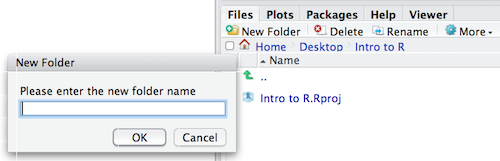

Approximate time: 180 minutes

## Learning Objectives

* What is R and R Studio
* Introduction to R Studio GUI and basic functionality.
* How to start coding in R.
* How to create your GitHub, creating a repository, and committing codes.
* Basic commands in R
* Organizing your working directory in R
* Project Announcement: Dataset and task

## What is R?

The common misconception is that R is a programming language but in fact it is much more than that. Think of R as an environment for statistical computing and graphics, which brings together a number of features to provide powerful functionality. Its most common use is to analyze and visualize data.

The R environment combines:

* Great resource for data analysis, data visualization, data science and machine learning
* Provides many statistical techniques (such as statistical tests, classification, clustering and data reduction)
* We can plot good graphics in R such as pie charts, histograms, box plot, scatter plot, etc++
* Works on different platforms (Windows, Mac, Linux)
* Open-source and free
* It has a large community support
* It has many packages (libraries of functions) that can be used to solve different problems

## Why use R?


R is a powerful, extensible environment. It has a wide range of statistics and general data analysis and visualization capabilities.

* Data handling, wrangling, and storage
* Wide array of statistical methods and graphical techniques available
* Easy to install on any platform and use (and it’s free!)
* Open source with a large and growing community of peers


## What is RStudio?

RStudio is freely available open-source Integrated Development Environment (IDE). RStudio provides an environment with many features to make using R easier and is a great alternative to working on R in the terminal. 


* Graphical user interface, not just a command prompt
* Great learning tool 
* Free for academic use
* Platform agnostic
* Open source


## Creating a new project directory in RStudio

Let's create a new project directory for our "Introduction to R" lesson today. 

1. Open RStudio
2. Go to the `File` menu and select `New Project`.
3. In the `New Project` window, choose `New Directory`. Then, choose `Empty Project`. Name your new directory `Intro-to-R` and then "Create the project as subdirectory of:" the Desktop (or location of your choice).
4. Click on `Create Project`.
5. After your project is completed, if the project does not automatically open in RStudio, then go to the `File` menu, select `Open Project`, and choose `Intro-to-R.Rproj`.
6. When RStudio opens, you will see three panels in the window.
7. Go to the `File` menu and select `New File`, and select `R Script`. The RStudio interface should now look like the screenshot below.


## RStudio Interface

**The RStudio interface has four main panels:**

1. **Console**: where you can type commands and see output. *The console is all you would see if you ran R in the command line without RStudio.*
2. **Script editor**: where you can type out commands and save to file. You can also submit the commands to run in the console.
3. **Environment/History**: environment shows all active objects and history keeps track of all commands run in console
4. **Files/Plots/Packages/Help**

## Organizing your working directory & setting up

### Viewing your working directory

Before we organize our working directory, let's check to see where our current working directory is located by typing into the console:

```r
getwd()
```

Your working directory should be the `Intro-to-R` folder constructed when you created the project. The working directory is where RStudio will automatically look for any files you bring in and where it will automatically save any files you create, unless otherwise specified. 

You can visualize your working directory by selecting the `Files` tab from the **Files/Plots/Packages/Help** window. 


If you wanted to choose a different directory to be your working directory, you could navigate to a different folder in the `Files` tab, then, click on the `More` dropdown menu and select `Set As Working Directory`.
 


### Structuring your working directory
To organize your working directory for a particular analysis, you should separate the original data (raw data) from intermediate datasets. For instance, you may want to create a `data/` directory within your working directory that stores the raw data, and have a `results/` directory for intermediate datasets and a `figures/` directory for the plots you will generate.

Let's create these three directories within your working directory by clicking on `New Folder` within the `Files` tab. 



When finished, your working directory should look like:


### Adding files to your working directory

There are a few files that we will be working with in the next few lessons and you can access them using the links provided below. If you right click on the link, and "Save link as..". Choose `~/Desktop/Intro-to-R/data` as the destination of the file. You should now see the file appear in your working directory. **We will discuss these files a bit later in the lesson.**

* Download the **data set contains information about the trees located on Belfast streets.** by clicking on [this link](http://www.belfastcity.gov.uk/nmsruntime/saveasdialog.aspx?lID=14543&sID=2430)

> *NOTE:* If the files download automatically to some other location on your laptop, you can move them to the your working directory using your file explorer or finder (outside RStudio), or navigating to the files in the `Files` tab of the bottom right panel of RStudio


## Interacting with R

Now that we have our interface and directory structure set up, let's start playing with R! There are **two main ways** of interacting with R in RStudio: using the **console** or by using **script editor** (plain text files that contain your code).

### Console window
The **console window** (in RStudio, the bottom left panel) is the place where R is waiting for you to tell it what to do, and where it will show the results of a command.  You can type commands directly into the console, but they will be forgotten when you close the session. 

Let's test it out:

```r
3 + 5
```


## What is GitHub?

GitHub is a code hosting platform for version control and collaboration. It lets you and others work together on projects from anywhere. Here we will teaches you GitHub essentials such repositories, branches, commits, and Pull Requests. You’ll create your own `Introduction2R` repository and commit all your work day-by-day.


To use GitHub you need a [GitHub](http://github.com/) account and Internet access. You don’t need to know how to code. However, please focus why we are using it. Now, please click here [Sign-Up](https://github.com/signup?ref_cta=Sign+up&ref_loc=header+logged+out&ref_page=%2F&source=header-home) to create a GitHub account. 

After creating GitHub account, please follow the given steps:

#### Step 1. Create a Repository

A repository is usually used to organize a single project. Repositories can contain folders and files, images, videos, spreadsheets, and data sets – anything your project needs. We recommend including a README, or a file with information about your project. GitHub makes it easy to add one at the same time you create your new repository. It also offers other common options such as a license file.

Your `Introduction2R` repository can be a place where you store ideas, resources, or even share and discuss things with others.

#### Step 2. To create a new repository
In the upper right corner, next to your avatar or identicon, click  and then select New repository.

1. Name your repository `Introduction2R`.
2. Write a short description.
3. Select Initialize this repository with a README.
4. Click `Create repository`.

#### Step 3. Make and commit changes

1. Click the README.md file.
2. Click the  pencil icon in the upper right corner of the file view to edit.
3. In the editor, write a bit about yourself.
4. Write a commit message that describes your changes.
5. Click Commit changes button.


## Basic R Commands?

##### Help

The `help()` function and `?` help operator in R provide access to the documentation pages for R functions, data sets, and other objects, both for packages in the standard R distribution and for contributed packages. To access documentation for the standard mean (average) function, for example, enter the command `help(mean)` or `help("mean")`, or `?mean` or `?"mean"` (i.e., the quotes are optional).

```r
help()
help(lm)
```

##### Example

```r
example(mean)
```

##### Let's add two numbers

When you type a command at the prompt and hit Enter, your computer executes the command and shows you the results. Then RStudio displays a fresh prompt for your next command. For example, if you type 10 + 5 and hit Enter, RStudio will display:

```r
10 + 5

```

You’ll notice that a [1] appears next to your result. R is just letting you know that this line begins with the first value in your result. Some commands return more than one value, and their results may fill up multiple lines. 

```r
10 : 130

```

For example, the command 10:130 returns 31 values; it creates a sequence of integers from 10 to 130. Notice that new bracketed numbers appear at the start of the second and third lines of output. You can mostly ignore the numbers that appear in brackets.

Note: In the above code, the colon operator (+) returns every integer between two integers. It is an easy way to create a sequence of numbers. You can also write `10:130` without line spacing.


##### Compiling R codes?

In languages such as C, Java, and FORTRAN, you have to compile your human-readable code into machine-readable code (often 1s and 0s) before you can run it. If you`ve programmed in such a language before, you may wonder whether you have to compile your R code before you can use it. The answer is no. R is a dynamic programming language, which means R automatically interprets your code as you run it.


##### Incomplete Commands in R
If you type an incomplete command and press Enter, R will display `5 -` prompt, which means it is waiting for you to type the rest of your command. Either finish the command or hit Escape to start over: Please see the example below:

```r
> 5 -
+ 1
[1] 4
```

##### Error message in R

If you type a command that R doesn’t recognize, R will return an error message. If you ever see an error message, don’t panic. R is just telling you that your computer couldn’t understand or do what you asked it to do. You can then try a different command at the next prompt: For example:

```r
> 3 % 5
Error: unexpected input in "3 % 5"
```

##### Comments in R

Comments are general English sentences, mostly written in a code to explain what it does or what a piece of code is supposed to do. Comments are completely ignored by the compiler and are thus never reflected on to the input.

Comments are generally used for the following purposes:

* Code Readability
* Explanation of the code or Metadata of the project
* Prevent execution of code
* To include resources

Types of Comments

There are generally three types of comments supported by languages, namely-

* Single-line Comments- Comment that only needs one line
* Multi-line Comments- Comment that requires more than one line.
* Documentation Comments- Comments that are drafted usually for a quick documentation look-up

```r
 # comment statement: Addting two numbers 
 2+3
```

##### Cancelling commands in R

Some R commands may take a long time to run. You can cancel a command once it has begun by typing ctrl + c. Note that it may also take R a long time to cancel the command.

---

### Exercise

Do the following tasks as your day 1 exercise:

1. Create your GitHub profile and first repository `Introduction2R`
2. Create your first `R` scripts using R-Studio: `File –> New File –> R Script` and name it. 
3. Simply try to add two numbers and print your answer. 
4. Now try to substract `5` from it and print your answer
5. Now multiply the answer with `3` using `*` operator and print the answer.
6. Now divide the number by 2 using `/` operator. 
