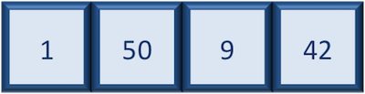

Approximate time: 180 minutes

## Learning Objectives

* Basic R Syntax
* Variables and tips on variable names
* Data Types in R
* Data Structures in R
* Strings in R
* Logic/Booleans
* Operators
* If/Else, While, For, Functions

## The R syntax
Now that we know how to talk with R via the script editor or the console, we want to use R for something more than adding numbers. To do this, we need to know more about the R syntax. 


Below is an example script highlighting the many different "parts of speech" for R (syntax):

  - the **comments** `#` and how they are used to document function and its content
  - **variables** and **functions**
  - the **assignment operator** `<-`
  - the `=` for **arguments** in functions

_NOTE: indentation and consistency in spacing is used to improve clarity and legibility_


## Assignment operator

To do useful and interesting things in R, we need to assign _values_ to
_variables_ using the assignment operator, `<-`.  For example, we can use the assignment operator to assign the value of `3` to `x` by executing:

```r
x <- 3
```

The assignment operator (`<-`) assigns **values on the right** to **variables on the left**. 

*In RStudio, typing `Alt + -` (push `Alt` at the same time as the `-` key) will write ` <- ` in a single keystroke.*


## Variables

A variable is a symbolic name for (or reference to) information. Variables in computer programming are analogous to "buckets", where information can be maintained and referenced. On the outside of the bucket is a name. When referring to the bucket, we use the name of the bucket, not the data stored in the bucket.

In the example above, we created a variable or a 'bucket' called `x`. Inside we put a value, `3`. 

Let's create another variable called `y` and give it a value of 5. 

```r
y <- 5
```

When assigning a value to an variable, R does not print anything to the console. You can force to print the value by using parentheses or by typing the variable name.

```
y
```

You can also view information on the variable by looking in your `Environment` window in the upper right-hand corner of the RStudio interface.


Now we can reference these buckets by name to perform mathematical operations on the values contained within. What do you get in the console for the following operation: 

```r
x + y
```

Try assigning the results of this operation to another variable called `number`. 

```r
number <- x + y
```

***
**Exercises**

1. Try changing the value of the variable `x` to 5. What happens to `number`?
2. Now try changing the value of variable `y` to contain the value 10. What do you need to do, to update the variable `number`?

***

### Tips on variable names
Variables can be given almost any name, such as `x`, `temp`, or
`student_id`. However, there are some rules / suggestions you should keep in mind:

- Make your names explicit and not too long.
- Avoid names starting with a number (`2x` is not valid but `x2` is)
- Avoid names of fundamental functions in R (e.g., `if`, `else`, `for`, see [here](https://stat.ethz.ch/R-manual/R-devel/library/base/html/Reserved.html) for a complete list). In general, even if it's allowed, it's best to not use other function names (e.g., `c`, `T`, `mean`, `data`) as variable names. When in doubt
check the help to see if the name is already in use. 
- Avoid dots (`.`) within a variable name as in `my.dataset`. There are many functions
in R with dots in their names for historical reasons, but because dots have a
special meaning in R (for methods) and other programming languages, it's best to
avoid them. 
- Use nouns for object names and verbs for function names
- Keep in mind that **R is case sensitive** (e.g., `my_area` is different from `My_Area`)
- Be consistent with the styling of your code (where you put spaces, how you name variable, etc.). In R, two popular style guides are [Hadley Wickham's style guide](http://adv-r.had.co.nz/Style.html) and [Google's](http://web.stanford.edu/class/cs109l/unrestricted/resources/google-style.html).


## Data Types

Variables can contain values of specific types within R. The six **data types** that R uses include: 

* `"numeric"` for any numerical value 
* `"character"` for text values, denoted by using quotes ("") around value   
* `"integer"` for integer numbers (e.g., `2L`, the `L` indicates to R that it's an integer)
* `"logical"` for `TRUE` and `FALSE` (the Boolean data type)
* `"complex"` to represent complex numbers with real and imaginary parts (e.g.,
  `1+4i`) and that's all we're going to say about them
* `"raw"` that we won't discuss further

The table below provides examples of each of the commonly used data types:

| Data Type  | Examples|
| -----------:|:-------------------------------:|
| Numeric:  | 1, 1.5, 20, pi|
| Character:  | “anytext”, “5”, “TRUE”|
| Integer:  | 2L, 500L, -17L|
| Logical:  | TRUE, FALSE, T, F|

## Data Structures

We know that variables are like buckets, and so far we have seen that bucket filled with a single value. Even when `number` was created, the result of the mathematical operation was a single value. **Variables can store more than just a single value, they can store a multitude of different data structures.** These include, but are not limited to, vectors (`c`), factors (`factor`), matrices (`matrix`), data frames (`data.frame`) and lists (`list`).


### Vectors

A vector is the most common and basic data structure in R, and is pretty much the workhorse of R. It's basically just a collection of values, mainly either numbers,



or characters,


or logical values,


**Note that all values in a vector must be of the same data type.** If you try to create a vector with more than a single data type, R will try to coerce it into a single data type. 

For example, if you were to try to create the following vector:


R will coerce it into:


The analogy for a vector is that your bucket now has different compartments; these compartments in a vector are called *elements*. 

Each **element** contains a single value, and there is no limit to how many elements you can have. A vector is assigned to a single variable, because regardless of how many elements it contains, in the end it is still a single entity (bucket). 

Let's create a vector of house price and assign it to a variable called `hPrice`. 

Each element of this vector contains a single numeric value, and three values will be combined together into a vector using `c()` (the combine function). All of the values are put within the parentheses and separated with a comma.


```r
hPrice <- c(5000000, 4500000, 3600000)
hPrice
```
*Note your environment shows the `hPrice` variable is numeric and tells you the `hPrice` vector starts at element 1 and ends at element 3 (i.e. your vector contains 3 values).*


A vector can also contain characters. Create another vector called `hQuality` with three elements, where each element corresponds with the quality of house.

```r
hQuality <- c("Good", "Average", "Bad")
hQuality
```

***
**Exercise**

Create a vector of numeric and character values by _combining_ the two vectors that we just created (`hPrice` and `hQuality`). Assign this combined vector to a new variable called `combined`. *Hint: you will need to use the combine `c()` function to do this*. 
Print the `combined` vector in the console, what looks different compared to the original vectors?

***

### Factors

A **factor** is a special type of vector that is used to **store categorical data**. Each unique category is referred to as a **factor level** (i.e. category = level). Factors are built on top of integer vectors such that each **factor level** is assigned an **integer value**, creating value-label pairs. 


Let's create a factor vector and explore a bit more.  We'll start by creating a character vector describing three different levels of expression:

```r
hQuality <- c("Good", "Average", "Bad","Good", "Average", "Bad", "Bad","Good")
```

Now we can convert this character vector into a *factor* using the `factor()` function:

```r
hQuality <- factor(hQuality)
```

So, what exactly happened when we applied the `factor()` function? 

The expression vector is categorical, in that all the values in the vector belong to a set of categories; in this case, the categories are `Good`, `Average`, and `Bad`. By turning the expression vector into a factor, the **categories are assigned integers alphabetically**, with Average=1, Bad=2, Good=3. This in effect assigns the different factor levels. 


***

### Matrix

A `matrix` in R is a collection of vectors of **same length and identical datatype**. Vectors can be combined as columns in the matrix or by row, to create a 2-dimensional structure.


Matrices are used commonly as part of the mathematical machinery of statistics. They are usually of numeric datatype and used in computational algorithms to serve as a checkpoint. For example, if input data is not of identical data type (numeric, character, etc.), the `matrix()` function will throw an error and stop any downstream code execution.

### Data Frame

A `data.frame` is the _de facto_ data structure for most tabular data and what we use for statistics and plotting. A `data.frame` is similar to a matrix in that it's a collection of vectors of the **same length** and each vector represents a column. However, in a dataframe **each vector can be of a different data type** (e.g., characters, integers, factors). 


A data frame is the most common way of storing data in R, and if used systematically makes data analysis easier. 

We can create a dataframe by bringing **vectors** together to **form the columns**. We do this using the `data.frame()` function, and giving the function the different vectors we would like to bind together. *This function will only work for vectors of the same length.*

```r
df <- data.frame(hPrice, hQuality)
```

*Note that you can view your data.frame object by clicking on its name in the `Environment` window.*

### Lists

Lists are a data structure in R that can be perhaps a bit daunting at first, but soon become amazingly useful. A list is a data structure that can hold any number of any types of other data structures.


If you have variables of different data structures you wish to combine, you can put all of those into one list object by using the `list()` function and placing all the items you wish to combine within parentheses:

```r
list1 <- list(hPrice, df, hQuality)
```
Print out the list to screen to take a look at the components:


## String

Any value written within a pair of single quote or double quotes in R is treated as a string. Internally R stores every string within double quotes, even when you create them with single quote.

##### Rules Applied in String Construction

* The quotes at the beginning and end of a string should be both double quotes or both single quote. *They can not be mixed*.

* Double quotes can be inserted into a string starting and ending with single quote.

* Single quote can be inserted into a string starting and ending with double quotes.

* Double quotes can not be inserted into a string starting and ending with double quotes.

* Single quote can not be inserted into a string starting and ending with single quote.

##### Examples of Valid Strings
Following examples clarify the rules about creating a string in R.

```r

# Start and end with single quote
a <- 'I love Essex'
print(a)

# Start and end with double quotes
b <- "I love Colchester Campus"
print(b)

# Single quote ' in between double quotes
c <- "I parked my car ' near North Building"
print(c)

# Double quotes " in between single quote
d <- 'I parked my car " near South Building'
print(d)

```

Here are a few example of invalid input strings:

```r
e <- 'Mixed quotes" 
print(e)

f <- 'Single quote ' inside single quote'
print(f)

g <- "Double quotes " inside double quotes"
print(g)
```

##### Assign a String to a Variable
Assigning a string to a variable is done with the variable followed by the `<-` operator and the string:

```r
str <- "Hello Essex"
str # print the value of str
```

##### Multiline Strings
You can assign a multiline string to a variable like this:

```r
str <- "Hello Essex.
I came to attend this course from Mars.
Do you think it is worth learning R?
I want to become Data Scientist on Mars."

str # print the value of str
```

##### String Length

There are many usesful string functions in R.
For example, to find the number of characters in a string, use the `nchar()` function:

```r
str <- "Hello World!"
nchar(str)
```

#### Check a String
Use the `grepl()` function to check if a character or a sequence of characters are present in a string:

```r
str <- "Hello Essex!"

grepl("H", str)
grepl("Hello", str)
grepl("Y", str)
```

#### Combine Two Strings
Use the `paste()` function to merge/concatenate two strings:

```r
str1 <- "Hello"
str2 <- "Colchester"

paste(str1, str2)
```

#### Escape Characters
To insert characters that are illegal in a string, you must use an escape character.

An escape character is a backslash `\` followed by the character you want to insert.

An example of an illegal character is a double quote inside a string that is surrounded by double quotes:

```r
str <- "We play cricket in "Lords" and it is the home of Cricket"

str
```
 When we use escape character:
 
 ```r
str <- "We play cricket in \"Lords\" and it is the home of Cricket"
str
cat(str)
```

Note: that auto-printing the str variable will print the backslash in the output. You can use the cat() function to print it without backslash.
 
#### Multiple strings

Multiple strings are often stored in a character vector, which you can create with c():

```r
c("We", "Love", "Essex")
```

#### Subsetting strings

You can extract parts of a string using `str_sub()`. As well as the string, `str_sub()` takes start and end arguments which give the (inclusive) position of the substring:

Note: to use such functions we need to install `tidyverse` package. 

```r
install.packages("tidyverse")
library(tidyverse)

x <- c("Apple", "Banana", "Pear")
str_sub(x, 1, 3)
```

We can go backwards as well:

```r
str_sub(x, -3, -1)
```

## R Booleans / Logical Values

### Booleans (Logical Values)

In programming, we often need to know if an expression is true or false.

We can evaluate any expression in R, and get one of two answers, `TRUE` or `FALSE`.

When you compare two values, the expression is evaluated and R returns the logical answer:

Example

```r
5 > 2    # TRUE because 5 is greater than 2
5 == 9   # FALSE because 5 is not equal to 9
100 < 98    # FALSE because 100 is greater than 98
```

We can also compare two variables:

```r
a <- 100
b <- 90

a > b
```

We can also use `if` function to compare the variables:

```r
a <- 100
b <- 93

if (b > a) {
  print ("b is greater than a")
} else {
  print("b is not greater than a")
}
```

## Operators

Operators are used to perform operations on variables and values.

For addition, we can use `+` operator:

```r
3 + 5
```

R divides the operators in the following groups:

* Arithmetic operators
* Assignment operators
* Comparison operators
* Logical operators
* Miscellaneous operators

#### R Arithmetic Operators

Arithmetic operators are used with numeric values to perform common mathematical operations:

| Operator      | Name | Example |
| ----- | -------- |------|
| +      | Addition       | a + b |
| -      | Substraction       | a - b |
| *      | Multiplication       | a * b |
| /      | Division        | a / b |
| %%      | Modulus (Remainder from division)        | a %% b |


Let's try all these arithmetic operators:


#### R Assignment Operators
Assignment operators are used to assign values to variables:

Note: `<<-` is a global assigner. 
It is also possible to turn the direction of the assignment operator.

`x <- 10` is equal to `10 -> x`

```r
my_var <- 10
my_var

my_var1 <<- 10
my_var1

10 -> my_var2
my_var2

10 ->> my_var3
my_var3

```

#### R Comparison Operators

Comparison operators are used to compare two values:

| Operator      | Name | Example |
| ----- | -------- |------|
| =      | Equal         | a = b |
| !=      | Not equal    | a != b |
| >      | greater than  | a > b |
| <      | less than     | a < b |
| >=      | Greater than or equal to       | a >= b |
| <=      | Less than or equal to       | a <= b |


## If/Else in R

#### Conditions and If Statements

R supports the usual logical conditions from mathematics as given above. These conditions can be used in several ways, most commonly in `if` statements and loops.

An `if` statement is written with the `if` keyword, and it is used to specify a block of code to be executed if a condition is `TRUE`:

```r
a <- 3
b <- 10

if (b > a) {
  print("b is greater than a")
}
```

*Note: R uses curly brackets { } to define the scope in the code.


#### Else If
The `else if` keyword is R's way of saying "if the previous conditions were not true, then try this condition":

```r
a <- 10
b <- 10

if (b > a) {
  print("b is greater than a")
} else if (a == b) {
  print ("a and b are equal")
}
```

*Note: You can use as many else if statements as you want in R.


#### If Else

The `else` keyword catches anything which isn't caught by the preceding conditions:

```r
a <- 20
b <- 10

if (b > a) {
  print("b is greater than a")
} else if (a == b) {
  print("a and b are equal")
} else {
  print("a is greater than b")
}
```

We can also use else without else if:

```r
a <- 20
b <- 10

if (b > a) {
  print("b is greater than a")
} else {
  print("b is not greater than a")
}
```

#### Nested If Statements

You can also have `if` statements inside `if` statements, this is called nested `if` statements.
For example:

```r
x <- 99

if (x > 10) {
  print("Above ten")
  if (x > 20) {
    print("and also above 20!")
  } else {
    print("but not above 20.")
  }
} else {
  print("below 10.")
}
```

#### AND
The `&` symbol (and) is a logical operator, and is used to combine conditional statements:

```r
a <- 20
b <- 33
c <- 50

if (a > b & c > a){
  print("Both conditions are true")
}
```

#### OR
The `|` symbol (or) is a logical operator, and is used to combine conditional statements:

```r
a <- 200
b <- 33
c <- 500

if (a > b | a > c){
  print("At least one of the conditions is true")
}
```

## Loops

Loops can execute a block of code as long as a specified condition is reached.
Loops are handy because they save time, reduce errors, and they make code more readable.

R has two loop commands:

* while loops
* for loops

#### R While Loops

With the `while` loop we can execute a set of statements as long as a condition is TRUE:
For example:

```r
i <- 1
while (i < 6) {
  print(i)
  i <- i + 1
}
```

#### Break

With the `break` statement, we can stop the loop even if the while condition is TRUE:

```r
i <- 1
while (i < 6) {
  print(i)
  i <- i + 1
  if (i == 4) {
    break
  }
}
```

#### Next

With the `next` statement, we can skip an iteration without terminating the loop:

```r
i <- 0
while (i < 6) {
  i <- i + 1
  if (i == 3) {
    next
  }
  print(i)
}
```

#### For Loops

A `for` loop is used for iterating over a sequence:

```r
for (x in 1:10) {
  print(x)
}
```

One more example:

```r
my_cars <- list("bmw", "audi", "tesla", "honda")

for (x in my_cars) {
  print(x)
}
```

## R Functions
A function is a block of code which only runs when it is called. You can pass data, known as parameters, into a function. A function can return data as a result.

A key feature of R is functions. Functions are **"self contained" modules of code that accomplish a specific task**. Functions usually take in some sort of data structure (value, vector, dataframe etc.), process it, and return a result.

The general usage for a function is the name of the function followed by parentheses:

```r
function_name(input)
```
The input(s) are called **arguments**, which can include:

1. the physical object (any data structure) on which the function carries out a task 
2. specifications that alter the way the function operates (e.g. options)

Not all functions take arguments, for example:

```r
getwd()
```

However, most functions can take several arguments. If you don't specify a required argument when calling the function, you will either receive an error or the function will fall back on using a *default*. 

The **defaults** represent standard values that the author of the function specified as being "good enough in standard cases". An example would be what symbol to use in a plot. However, if you want something specific, simply change the argument yourself with a value of your choice.

### Basic functions

We have already used a few examples of basic functions in the previous lessons i.e `getwd()`, `c()`, and  `factor()`. These functions are available as part of R's built in capabilities, and we will explore a few more of these base functions below. 

#### Creating a Function
To create a function, use the `function()` keyword:

```r
my_function <- function() { # create a function with the name my_function
  print("Hello World!")
}
```

#### Call a Function
To call a function, use the function name followed by parenthesis, like `my_function()`:

```r
my_function <- function() {
  print("Hello World!")
}

my_function() # call the function named my_function
```

#### Arguments
Information can be passed into functions as arguments.

Arguments are specified after the function name, inside the parentheses. You can add as many arguments as you want, just separate them with a comma.

The following example has a function with one argument (fname). When the function is called, we pass along a first name, which is used inside the function to print the full name:

```r
my_function <- function(fname) {
  paste("I Love", fname)
}

my_function("Colchester")
my_function("Essex")
my_function("University of Essex")
```

#### Number of Arguments

By default, a function must be called with the correct number of arguments. Meaning that if your function expects 2 arguments, you have to call the function with 2 arguments, not more, and not less:

```r
my_function <- function(fname, lname) {
  paste(fname, lname)
}

my_function("Haider", "Raza")
```


### Exercise

* Create a vector of number of dices (e.g. 1,2,3,4,5,6) and print it using for loop
* Create a function name `my_addtition()` and add two numbers.
