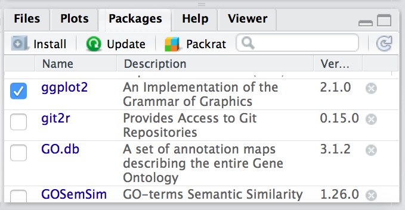

***
Approximate time: 180 minutes

## Learning Objectives

* Packages and Libraries
* Package installation from CRAN
* Reading data into R
* Inspecting data structures
* Dataframe and using in Data Analysis
* Writing to files

***

## Packages and Libraries

**Packages** are collections of R functions, data, and compiled code in a well-defined format, created to add specific functionality. There are 10,000+ user contributed packages and growing.

There are a set of **standard (or base) packages** which are considered part of the R source code and automatically available as part of your R installation. Base packages contain the **basic functions** that allow R to work, and enable standard statistical and graphical functions on datasets; for example, all of the functions that we have been using so far in our examples. 

The directories in R where the packages are stored are called the **libraries**. The terms *package* and *library* are sometimes used synonymously and there has been [discussion](http://www.r-bloggers.com/packages-v-libraries-in-r/) amongst the community to resolve this. It is somewhat counter-intuitive to _load a package_ using the `library()` function and so you can see how confusion can arise.


You can check what libraries are loaded in your current R session by typing into the console:

```r
sessionInfo() #Print version information about R, the OS and attached or loaded packages

# OR

search() #Gives a list of attached packages
```

In this workshop we have introduced you to functions from the standard base packages. However, the more you work with R you will come to realize that there is a cornucopia of R packages that offer a wide variety of functionality. To use additional packages will require installation. Many packages can be installed from the [CRAN](http://cran.r-project.org/).

### Package installation from CRAN 

CRAN is a repository where the latest downloads of R (and legacy versions) are found in addition to source code for thousands of different user contributed R packages.


Packages for R can be installed from the [CRAN](http://cran.r-project.org/) package repository using the `install.packages` function. This function will download the source code from on the CRAN mirrors and install the package (and any dependencies) locally on your computer. 

An example is given below for the `ggplot2` package that will be required for some plots we will create later on. Run this code to install `ggplot2`.

```r
install.packages("ggplot2")
```

### Loading libraries
Once you have the package installed, you can **load the library** into your R session for use. Any of the functions that are specific to that package will be available for you to use by simply calling the function as you would for any of the base functions. *Note that quotations are not required here.*

```r
library(ggplot2)
```

In this case there are several other packages that were also loaded along with `ggplot2`.

### Finding functions specific to a package

This is your first time using `ggplot2`, how do you know where to start and what functions are available to you? One way to do this, is by using the `Package` tab in RStudio. If you click on the tab, you will see listed all packages that you have installed. For those *libraries that you have loaded*, you will see a blue checkmark in the box next to it. Scroll down to `ggplot2` in your list:

  


If your library is successfully loaded you will see the box checked, as in the screenshot above. Now, if you click on `ggplot2` RStudio will open up the help pages and you can scroll through.

An alternative is to find the help manual online, which can be less technical and sometimes easier to follow. For example, [this website](http://docs.ggplot2.org/current/) is much more comprehensive for ggplot2 and is the result of a Google search. 

### Finding functions but not knowing which package it is a part of

If you are looking for a function to do a particular task, you can use `help.search()` (*but only looks through the installed packages*):

```r
help.search("scatter")
```

If you can't find what you are looking for, you can use the [rdocumention.org](https://www.rdocumentation.org/) website that search through the help files across all packages available.

### Cryptic error messages

It is very likely that someone else has encountered this same problem already! 

* Start by googling the error message.  However, this doesn't always work very well because often, package developers rely on the error catching provided by R. You end up with general error messages that might not be very helpful to diagnose a problem (e.g. "subscript out of bounds").

* Check stackoverflow. Search using the `[r]` tag. Most questions have already been answered, but the challenge is to use the right words in the search to find the answers: [http://stackoverflow.com/questions/tagged/r](http://stackoverflow.com/questions/tagged/r)

***

**Exercise**

The `ggplot2` package is part of the [`tidyverse` suite of integrated packages](https://www.tidyverse.org/packages/) which was designed to work together to make common data science operations more user-friendly. **We will be using the `tidyverse` suite in later lessons, and so let's install it**. _NOTE: This suite of packages is only available in CRAN._ 
***

## Reading data into R

### The basics
Regardless of the specific analysis in R we are performing, we usually need to bring data in for any analysis being done in R, so learning how to read in data is a crucial component of learning to use R.

Many functions exist to read data in, and the function in R you use will depend on the file format being read in. Below we have a table with some examples of functions that can be used for importing some common text data types (plain text).

| Data type               | Extension | Function          | Package            |
|:------------------------|:----------|:------------------|:-------------------|
| Comma separated values  | csv       | `read.csv()`      | utils (default)    |
|                         |           | `read_csv()`      | readr (tidyverse)  |
| Tab separated values    | tsv       | `read_tsv()`      | readr              |
| Other delimited formats | txt       | `read.table()`    | utils              |
|                         |           | `read_table()`    | readr              |
|                         |           | `read_delim()`    | readr              |

For example, if we have text file where the columns are separated by commas (comma-separated values or comma-delimited), you could use the function `read.csv`. However, if the data are separated by a different delimiter in a text file (e.g. ":", ";", " "), you could use the generic `read.table` function and specify the delimiter (`sep = " "`) as an argument in the function. 

### Let's start reading data in R

```r
?read.csv
```

The `read.csv` function has *one required argument* and several *options* that can be specified. The mandatory argument is a path to the file and filename, which in our case is `Intro-to-R-master/data/odTrees.csv`. We will put the function to the right of the assignment operator, meaning that **any output will be saved as the variable name provided on the left**.

```r
# Before reading your data, please check your current working directory
treeData <- read.csv(file="Data/odTrees.csv")
```

> *Note: By default, `read.csv` converts (= coerces) columns that contain characters (i.e., text) into the `factor` data type. Depending on what you want to do with the data, you may want to keep these columns as `character`. To do so, `read.csv()` and `read.table()` have an argument called `stringsAsFactors` which can be set to `FALSE`.*


### Inspecting data structures

There are a wide selection of base functions in R that are useful for inspecting your data and summarizing it. Let's use the `treeData` file that we created to test out data inspection functions. 

Take a look at the dataframe by typing out the variable name `treeData` and pressing return; the variable contains information describing the samples in our study. Each row holds information for a single sample, and the columns contain categorical information about the sample `TYPEOFTREE`(ParkTree or StreetTree), and `SPECIESTYPE` (1,2,...,53).


```r
treeData

      TYPEOFTREE     SPECIESTYPE                                SPECIES          AGE          DESCRIPTION
1       ParkTree          Cherry              Prunus cerasifera 'Nigra' Young Mature          Semi-Mature
2       ParkTree           Maple                    Acer pseudoplatanus        Young       Juvenile/Young
3       ParkTree          Poplar                           Populus alba        Young       Juvenile/Young
4       ParkTree           Mixed                        Mixed broadleaf        Young       Juvenile/Young
5       ParkTree            Pine                            Pinus nigra Young Mature          Semi-Mature
6       ParkTree             Oak                          Quercus robur Fully Mature         Fully Mature


      TREELOCATIONY LONGITUDE LATITUDE TREETAG TREEHEIGHTinMETRES
1          367682.7 -5.981870 54.54062     292                  8
2          367705.0 -5.982504 54.54083     305                 14
3          372798.8 -5.880162 54.58485      29                 12
4          372339.0 -5.928477 54.58155    1022                 12
5          371468.7 -5.955712 54.57419     115                 13
6          373057.0 -5.883899 54.58723     190                 20
```

Suppose we had a larger file, we might not want to display all the contents in the console. Instead we could check the top (the first 6 lines) of this `data.frame` using the function `head()`:

```r
head(treeData)
```

We could also check the bottom (the last 6 lines) of this `data.frame` using the function `tail()`:

```r
tail(treeData)
```

Previously, we had mentioned that character values get converted to factors by default using `data.frame`. One way to assess this change would be to use the __`str`__ucture function. You will get specific details on each column:

```r
> str(treeData)
'data.frame':	37557 obs. of  16 variables:
 $ TYPEOFTREE           : Factor w/ 2 levels "ParkTree","StreetTree": 1 1 1 1 1 1 1 2 2 1 ...
 $ SPECIESTYPE          : Factor w/ 53 levels "Alder","Amelanchier",..: 8 32 41 33 38 36 46 5 37 5 ...
 $ SPECIES              : Factor w/ 189 levels "Abies grandis",..: 127 16 114 96 107 145 43 64 135 64 ...
 $ AGE                  : Factor w/ 7 levels "","Fully Mature",..: 7 6 6 6 7 2 4 4 3 4 ...
 $ DESCRIPTION          : Factor w/ 9 levels "Extra Heavy Standard",..: 9 4 4 4 9 2 5 5 3 5 ...
 $ TREESURROUND         : Factor w/ 13 levels "Bare Ground",..: 10 10 5 10 5 1 13 11 11 1 ...
 $ VIGOUR               : Factor w/ 3 levels "Low","N/A","Normal": 1 3 3 3 3 2 3 1 1 1 ...
 $ CONDITION            : Factor w/ 7 levels "Dead","Dying",..: 6 3 3 3 6 3 6 3 6 3 ...
 $ DIAMETERinCENTIMETRES: int  70 32 -29 21 47 97 90 96 7 84 ...
 $ SPREADRADIUSinMETRES : int  5 5 2 4 7 11 7 7 1 9 ...
 $ TREELOCATIONX        : num  330667 330625 337100 333988 332251 ...
 $ TREELOCATIONY        : num  367683 367705 372799 372339 371469 ...
 $ LONGITUDE            : num  -5.98 -5.98 -5.88 -5.93 -5.96 ...
 $ LATITUDE             : num  54.5 54.5 54.6 54.6 54.6 ...
 $ TREETAG              : Factor w/ 3989 levels "","0","0725",..: 2138 2283 2115 31 172 1005 1049 1 2 3342 ...
 $ TREEHEIGHTinMETRES   : num  8 14 12 12 13 20 16 18 0 26 ...
```

__You can also get this information from the "Environment" tab in RStudio.__

### List of functions for data inspection

We already saw how the functions `head()` and `str()` can be useful to check the
content and the structure of a `data.frame`. Here is a non-exhaustive list of
functions to get a sense of the content/structure of data.

* All data structures - content display:
	- **`str()`:** compact display of data contents (env.)
	- **`class()`:** data type (e.g. character, numeric, etc.) of vectors and data structure of dataframes, matrices, and lists.
	- **`summary()`:** detailed display, including descriptive statistics, frequencies
	- **`head()`:** will print the beginning entries for the variable
	- **`tail()`:** will print the end entries for the variable
* Vector and factor variables: 
	- **`length()`:** returns the number of elements in the vector or factor
* Dataframe and matrix variables:
	- **`dim()`:** returns dimensions of the dataset
	- **`nrow()`:** returns the number of rows in the dataset
	- **`ncol()`:** returns the number of columns in the dataset
	- **`rownames()`:** returns the row names in the dataset  
	- **`colnames()`:** returns the column names in the dataset

### Dataframes

Dataframes (and matrices) have 2 dimensions (rows and columns), so if we want to select some specific data from it we need to specify the "coordinates" we want from it. We use the same square bracket notation but rather than providing a single index, there are *two indices required*. Within the square bracket, **row numbers come first followed by column numbers (and the two are separated by a comma)**. Let's explore the `treeData` dataframe

For example:

```r
treeData[1, 1]   # element from the first row in the first column of the data frame
treeData[1, 3]   # element from the first row in the 3rd column
```

Now if you only wanted to select based on rows, you would provide the index for the rows and leave the columns index blank. The key here is to include the comma, to let R know that you are accessing a 2-dimensional data structure:

```r
treeData[3, ]    # vector containing all elements in the 3th row
```

If you were selecting specific columns from the data frame - the rows are left blank:

```r
treeData[ , 4]    # vector containing all elements in the 4th column
```

Just like with vectors, you can select multiple rows and columns at a time. Within the square brackets, you need to provide a vector of the desired values:	

```r
treeData[ , 1:2] # dataframe containing first two columns
treeData[c(1,3,6), ] # dataframe containing first, third and sixth rows
```

For larger datasets, it can be tricky to remember the column number that corresponds to a particular variable. (Is celltype in column 1
or 2? oh, right... they are in column 1). In some cases, the column number for a variable can change if the script you are using adds or removes columns. It's therefore often better to use column names to refer to a particular variable, and it makes your code easier to read and your intentions clearer.

```r
treeData[1:3 , "AGE"] # elements of the AGE column corresponding to the first three samples
```


You can do operations on a particular column, by selecting it using the `$` sign. In this case, the entire column is a vector. For instance, to extract all the genotypes from our dataset, we can use: 

```r
treeData$CONDITION 
```
You can use `colnames(treeData)` or `names(treeData)` to remind yourself of the column names. We can then supply index values to select specific values from that vector. For example, if we wanted the AGE information for the first five samples in `treeData`:

```r
colnames(treeData)

treeData$AGE[1:5]
```

The `$` allows you to select a single column by name. To select multiple columns by name, you need to  concatenate a vector of strings that correspond to column names: 

```r
treeData[, c("AGE", "CONDITION")]
```

```r
               AGE CONDITION
1     Young Mature      Poor
2            Young      Fair
3            Young      Fair
4            Young      Fair
5     Young Mature      Poor
6     Fully Mature      Fair
7           Mature      Poor
8           Mature      Fair
9         Juvenile      Poor
10          Mature      Fair
11    Fully Mature      Fair
12          Mature      Fair
13    Fully Mature      Fair
14          Mature      Fair
15    Fully Mature      Poor
16    Young Mature      Poor
17                 Very Poor
18          Mature      Fair
19    Fully Mature      Fair
20    Fully Mature      Fair
21          Mature      Fair
```


#### Selecting using indices with logical operators

With dataframes, similar to vectors, we can use logical vectors for specific columns in the dataframe to select only the rows in a dataframe with TRUE values at the same position or index as in the logical vector. We can then use the logical vector to return all of the rows in a dataframe where those values are TRUE.

```r
idx <- treeData$CONDITION== "Fair"
	
treeData[idx, ]
```

##### Selecting indices with logical operators using the `which()` function
As you might have guessed, we can also use the `which()` function to return the indices for which the logical expression is TRUE. For example, we can find the indices where the `CONDITION` is `Poor` within the `treeData` dataframe:

```r
idx <- which(treeData$CONDITION == "Poor")
	
treeData[idx, ]
```


Let's save this output to a variable:

```r
sub_meta <- treeData[idx, ]
```

***

**Exercise**  

Subset the `treeData` dataframe to return only the rows of data with a SPICESTYPE of `Cherry`.
	
***

> **NOTE:** There are easier methods for subsetting **dataframes** using logical expressions, including the `filter()` and the `subset()` functions. These functions will return the rows of the dataframe for which the logical expression is TRUE, allowing us to subset the data in a single step.


### Writing to file 

Everything we have done so far has only modified the data in R; the files have remained unchanged. Whenever we want to save our datasets to file, we need to use a `write` function in R. 

To write our matrix to file in comma separated format (.csv), we can use the `write.csv` function. There are two required arguments: the variable name of the data structure you are exporting, and the path and filename that you are exporting to. By default the delimiter is set, and columns will be separated by a comma:

```r
write.csv(sub_meta, file="data/subset_meta.csv")
```

Similar to reading in data, there are a wide variety of functions available allowing you to export data in specific formats. Another commonly used function is `write.table`, which allows you to specify the delimiter you wish to use. This function is commonly used to create tab-delimited files.

> **NOTE:** Sometimes when writing a dataframe with row names to file, the column names will align starting with the row names column. To avoid this, you can include the argument `col.names = NA` when writing to file to ensure all of the column names line up with the correct column values.


***

