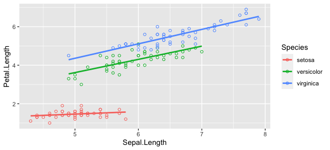

Approximate time: 120 minutes


## Basic plots in R
R has a number of built-in tools for basic graph types such as histograms, scatter plots, bar charts, boxplots and much [more](http://www.statmethods.net/graphs/). Rather than going through all of different types, we will focus on `plot()`, a generic function for plotting x-y data. 

To get a quick view of the different things you can do with `plot`, let's use the `example()` function:
```r	
example("plot")
```

Here, you will find yourself having to press `<Return>` so you can scroll through the different types of graphs generated by `plot`. Take note of the different parameters used with each command and how that affects the aesthetics of the plot. 

```r
dev.off() 
# this means "device off" and we will be going over what this does at the end of this section. 
# For now, it makes it so that when we draw plots they show up where they are supposed to?
```

### Line Charts

First we'll produce a very simple graph using the values in the `car` vector:

```r
# Define the cars vector with 5 values
cars <- c(1, 3, 6, 4, 9)

# Graph the cars vector with all defaults
plot(cars)
```


Let's add a title, a line to connect the points, and some color:

```r
# Define the cars vector with 5 values
cars <- c(1, 3, 6, 4, 9)

# Graph cars using blue points overlayed by a line 
plot(cars, type="o", col="blue")

# Create a title with a red, bold/italic font
title(main="Autos", col.main="red", font.main=4)
```


Now let's add a red line for trucks and specify the y-axis range directly so it will be large enough to fit the truck data:

```r
# Define 2 vectors
cars <- c(1, 3, 6, 4, 9)
trucks <- c(2, 5, 4, 5, 12)

# Graph cars using a y axis that ranges from 0 to 12
plot(cars, type="o", col="blue", ylim=c(0,12))

# Graph trucks with red dashed line and square points
lines(trucks, type="o", pch=22, lty=2, col="red")

# Create a title with a red, bold/italic font
title(main="Autos", col.main="red", font.main=4)
```


### Bar Charts

Let's start with a simple bar chart graphing the cars vector:

```r
# Define the cars vector with 5 values
cars <- c(1, 3, 6, 4, 9)

# Graph cars
barplot(cars)
```


### Histograms

Let's start with a simple histogram graphing the distribution of the suvs vector:

```r
# Define the suvs vector with 5 values
suvs <- c(4,4,6,6,16)

# Create a histogram for suvs
hist(suvs)
```


### Pie Charts

Let's start with a simple pie chart graphing the cars vector:

```r
# Define cars vector with 5 values
cars <- c(1, 3, 6, 4, 9)

# Create a pie chart for cars
pie(cars)
```


## Advance Plotting in R with ggplot2 

`ggplot2` is an R package used for statistical computing and data representation using data visualization. It follows underlying graphics called `Grammar of Graphics`, which includes certain rules and independent components which can be used to represent data in various formats. 


### Relationship between “Grammar of Graphics” and R

`ggplot` uses statistical graphics for mapping the data to aesthetic attributes such as color, shape, size of the concerned geometric objects like points, lines and bars. The plot may also contain various statistical transformations of the concerned data which is drawn on the mentioned coordinate system.

We can build different types of plots which can be created with reference to the grammar:

* Data
* Layers
* Scales
* Coordinate Systems
* Faceting
* Theme

To install the package, we need to run

```r
install.packages("ggplot2")
```

To load the particular package, we need to follow the below mentioned syntax −

```r
library(ggplot2)
```

Let's read our first data

```r
data(iris)
```

Plotting the iris dataset plot with ggplot2 in simpler manner involves the following syntax −

```r
iris <- ggplot(iris, aes(Sepal.Length, Petal.Length, colour=Species)) + geom_point()
print(iris)
```


Here we can modify the title, x label and y label which means x axis and y axis labels in systematic format as given below −

```r
print(iris + labs(y="Petal length (cm)", x = "Sepal length (cm)") 
      + ggtitle("Petal and sepal length of iris"))
```


### Highlight and tick marks

Plot the markers with mentioned co-ordinates of x and y axes as mentioned below. It includes adding text, repeating text, highlighting particular area and adding segment as follows −

```r
# add text
iris + annotate("text", x = 6, y = 5, label = "text")

# add repeat
iris + annotate("text", x = 4:6, y = 5:7, label = "text")

# highlight an area
iris + annotate("rect", xmin = 5, xmax = 7, ymin = 4, ymax = 6, alpha = .5)

# segment
iris + annotate("segment", x = 5, xend = 7, y = 4, yend = 5, colour = "black")
```

|                  |  | 
|:-----------------|----:|
|| | 
|| | 


### Now let's explore another dataset (i.e. PlantGrowth Dataset)

A simple plot with required x and y axis of the graph as mentioned below

```r
plant_plot <- ggplot(PlantGrowth, aes(x=group, y=weight)) + 
  geom_point()
print(plant_plot)
```


Task 1: 
`Can you please swipe x and y axes?`


### Legends in `ggplot`

Let's load the `iris` data again and plot

```r
data(iris)
iris <- ggplot(iris, aes(Sepal.Length, Petal.Length, colour=Species)) + geom_point()
print(iris)
```


Now let's remove the legend

```r
iris + theme(legend.position = "none")
```


Now let's bring it back and change the legend position to top

```r
data(iris)
iris <- ggplot(iris, aes(Sepal.Length, Petal.Length, colour=Species)) + geom_point()
iris<- iris + theme(legend.position = "top")
print(iris)
```


We can also change the font style of legends

```r
library(ggplot2)
data(iris)
iris <- ggplot(iris, aes(Sepal.Length, Petal.Length, colour=Species)) + geom_point()
print(iris)
iris <- iris + theme(legend.title = element_text(colour = "blue", size = 10))
print(iris)
iris <- iris + theme(legend.text = element_text(colour = "red", size = 10))
print(iris)
```


### Scatter Plot in R

For creating a basic scatter plot following command is executed 
```r
library(ggplot2)
data(iris)
iris <- ggplot(iris, aes(Sepal.Length, Petal.Length)) + geom_point()
print(iris)
```


We can change the shape of points with a property called shape in geom_point() function.

```r
library(ggplot2)
data(iris)
iris <- ggplot(iris, aes(Sepal.Length, Petal.Length)) + geom_point(shape = 1)
print(iris)
```


We can add color to the points which is added in the required scatter plots.

```r
library(ggplot2)
data(iris)
iris <- ggplot(iris, aes(Sepal.Length, Petal.Length, colour  = Species)) + geom_point(shape = 1)
print(iris)
```


### Smoothing and fitting regression

We will focus on establishing relationship between the variables.

`geom_smooth` function aids the pattern of overlapping and creating the pattern of required variables. The attribute method “lm” mentions the regression line which needs to be developed.

```r
library(ggplot2)
data(iris)
iris <- ggplot(iris, aes(Sepal.Length, Petal.Length, colour  = Species)) + 
  geom_point(shape = 1) +
  geom_smooth(method = lm)
print(iris)
```


We can also add a regression line with no shaded confidence region with below mentioned:

```r
library(ggplot2)
data(iris)
iris <- ggplot(iris, aes(Sepal.Length, Petal.Length, colour  = Species)) + 
  geom_point(shape = 1) +
  geom_smooth(method = lm, se = FALSE)
print(iris)
```


### Bar Plots & Histograms

Bar plots represent the categorical data in rectangular manner. The bars can be plotted vertically and horizontally. The heights or lengths are proportional to the values represented in graphs. The `x` and `y` axes of bar plots specify the category which is included in specific data set.

Histogram is a bar graph which represents the raw data with clear picture of distribution of mentioned data set.

Let's inspect the MPG dataset. This dataset contains a subset of the fuel economy data that the EPA makes available on https://fueleconomy.gov/. It contains only models which had a new release every year between 1999 and 2008 - this was used as a proxy for the popularity of the car.

```r
library(ggplot2)
mpg
```

Now let's create a first bar count plot. We will use geom_bar() function which is used for creating bar plots. It takes the attribute of statistical value called count.

```r
b_plot<-ggplot(mpg, aes(x=factor(cyl))) + geom_bar(stat = "count")
b_plot
```


Now let's create our first histogram. We will use geom_histogram(), which includes all the necessary attributes for creating a histogram. Here, it takes the attribute of hwy with respective count. The color is taken as per the requirements.


```r
ggplot(data = mpg, aes(x=hwy)) + 
  geom_histogram(col = "red",
                 fill = "green", 
                 alpha = 0.2, 
                 binwidth = 5)
```


### Box plot

The `ggplot2` library allows to make a boxplot using `geom_boxplot()`. You have to specify a quantitative variable for the Y axis, and a qualitative variable for the X axis ( a group).


```r
library(ggplot2)
 
# The mtcars dataset is natively available
# head(mtcars)
 
# A really basic boxplot.
ggplot(mtcars, aes(x=as.factor(cyl), y=mpg)) + 
    geom_boxplot(fill="slateblue", alpha=0.2) + 
    xlab("cyl")
```


## Statistics in R

Statistical analysis in R is performed by using many in-built functions. Most of these functions are part of the R base package. These functions take R vector as an input along with the arguments and give the result.

We will be discussing mean, median and mode.


### Mean
It is calculated by taking the sum of the values and dividing with the number of values in a data series. The function `mean()` is used to calculate this in R.


```r
# Create a vector. 
x <- c(12,7,3,4.2,18,2,54,-21,8,-5)
# Find Mean.
result.mean <- mean(x)
print(result.mean)
```

#### Applying NA Option

If there are missing values, then the mean function returns NA.
To drop the missing values from the calculation use `na.rm = TRUE`. which means remove the `NA` values.

```r
x <- c(12,7,3,4.2,18,2,54,-21,8,-5,NA)

# Find mean
result.mean <-  mean(x)
print(result.mean)

# Find mean dropping NA values
result.mean <-  mean(x,na.rm = TRUE)
print(result.mean)
```

### Median
The middle most value in a data series is called the median. The `median()` function is used in R to calculate this value.

```r
# Create the vector.
x <- c(12,7,3,4.2,18,2,54,-21,8,-5)

# Find the median.
median.result <- median(x)
print(median.result)
```

### Mode
The mode is the value that has highest number of occurrences in a set of data. Unike mean and median, mode can have both numeric and character data. 

R does not have a standard in-built function to calculate mode. So we create a user function to calculate mode of a data set in R. This function takes the vector as input and gives the mode value as output.

```r
# Create the function.
getmode <- function(v) {
   uniqv <- unique(v)
   uniqv[which.max(tabulate(match(v, uniqv)))]
}

# Create the vector with numbers.
v <- c(2,1,2,3,1,2,3,4,1,5,5,3,2,3)

# Calculate the mode using the user function.
result <- getmode(v)
print(result)
```

We can calculate the mode of characters as well:

```r
# Create the vector with characters.
charv <- c("I","Love","Essex","Pizza","at", "Essex")

# Calculate the mode using the user function.
result <- getmode(charv)
print(result)
```

### Min and Max in R

The R `max` function returns the maximum value of a vector or column.
Let's take a vector from the above example:

```r
v <- c(2,1,2,3,1,2,3,4,1,5,5,3,2,3)
max(v)
```

The R `min` function returns the minimum value of a vector or column.

```r
v <- c(2,1,2,3,1,2,3,4,1,5,5,3,2,3)
min(v)
```

But the problem comes when you have NA in the vector

```r
v <- c(2,1,2,3,1,2,3,4,1,NA,5,3,2,3)
max(v)   
max(v, na.rm = TRUE)    
```

We can see the same in `min` function
```r
v <- c(2,1,2,3,1,2,3,4,1,NA,5,3,2,3)
min(v)   
min(v, na.rm = TRUE)    
```

## Introduction to Machine Learning in R

Machine learning is a branch in computer science that studies the design of algorithms that can learn. Typical machine learning tasks are concept learning, function learning or “predictive modeling”, clustering and finding predictive patterns. These tasks are learned through available data that were observed through experiences or instructions, for example. Machine learning hopes that including the experience into its tasks will eventually improve the learning. The ultimate goal is to improve the learning in such a way that it becomes automatic, so that humans like ourselves don’t need to interfere any more.


### Types of Machine Learning

**Supervised learning**: the learning algorithm is presented with labelled example inputs, where the labels indicate the desired output. SML itself is composed of classification, where the output is categorical, and regression, where the output is numerical.

**Unsupervised learning**: no labels are provided, and the learning algorithm focuses solely on detecting structure in unlabelled input data.

**Reinforcement learning**: the learning algorithm performs a task using feedback from operating in a real or synthetic environment.


## Simple Linear Regression in R

Linear regression is used to predict a quantitative outcome $y$ on the basis of one single predictor variable $x$. The goal is to build a mathematical model (or formula) that defines $y$ as a function of the $x$ variable.

Once, we built a statistically significant model, it’s possible to use it for predicting future outcome on the basis of new $x$ values.

Consider that, we want to evaluate the impact of advertising budgets of three medias (`youtube`, `facebook` and `newspaper`) on future sales. This example of problem can be modeled with linear regression.


#### Formula and basics
The mathematical formula of the linear regression can be written as $y = b0 + b1*x + e$, where:

* $b0$ and $b1$ are known as the regression beta coefficients or parameters:
* $b0$ is the intercept of the regression line; that is the predicted value when $x = 0$.
* $b1$ is the slope of the regression line.
* $e$ is the error term (also known as the residual errors), the part of $y$ that can be explained by the regression model


The figure below illustrates the linear regression model, where:


* the best-fit regression line is in blue
* the intercept ($b0$) and the slope ($b1$) are shown in green
* the error terms ($e$) are represented by vertical red lines


From the scatter plot above, it can be seen that not all the data points fall exactly on the fitted regression line. Some of the points are above the blue curve and some are below it; overall, the residual errors ($e$) have approximately mean zero.

The sum of the squares of the residual errors are called the `Residual Sum of Squares` or `RSS`.

The average variation of points around the fitted regression line is called the `Residual Standard Error (RSE)`. This is one the metrics used to evaluate the overall quality of the fitted regression model. The lower the `RSE`, the better it is. Since the mean error term is zero, the outcome variable y can be approximately estimated as follow:


\(y \sim b0 + b1*x\)

Mathematically, the beta coefficients ($b0$ and $b1$) are determined so that the `RSS` is as minimal as possible. This method of determining the beta coefficients is technically called `least squares regression` or `ordinary least squares (OLS)` regression.

Once, the beta coefficients are calculated, a `t-test` is performed to check whether or not these coefficients are significantly different from zero. A non-zero beta coefficients means that there is a significant relationship between the predictors ($x$) and the outcome variable ($y$).

##### Loading required R packages

* tidyverse for data manipulation and visualization
* ggpubr: creates easily a publication ready-plot


```r
install.packages("ggpubr")
install.packages("datarium")
library(tidyverse)
library(ggpubr)
```

We’ll use the marketing data set [datarium package]. It contains the impact of three advertising medias (youtube, facebook and newspaper) on sales. Data are the advertising budget in thousands of dollars along with the sales. The advertising experiment has been repeated 200 times with different budgets and the observed sales have been recorded.

Let's load our dataset

```r
# Load the package
data("marketing", package = "datarium")
head(marketing, 4)

  youtube facebook newspaper sales
1  276.12    45.36     83.04 26.52
2   53.40    47.16     54.12 12.48
3   20.64    55.08     83.16 11.16
4  181.80    49.56     70.20 22.20
```
We want to predict `future sales` on the basis of `advertising budget spent on youtube`.


##### Visualization
Create a scatter plot displaying the sales units versus youtube advertising budget.
Add a smoothed line

```r
ggplot(marketing, aes(x = youtube, y = sales)) +
  geom_point() +
  stat_smooth()
```


The graph above suggests a linearly increasing relationship between the `sales` and the `youtube` variables. This is a good thing, because, one important assumption of the `linear regression` is that the relationship between the outcome and predictor variables is linear and additive.

It’s also possible to compute the correlation coefficient between the two variables using the R function `cor()`:

```r
cor(marketing$sales, marketing$youtube)
```

Output:

```r
Correlation: 0.78
```

The correlation coefficient measures the level of the association between two variables `x` and `y`. Its value ranges between `-1 (perfect negative correlation: when x increases, y decreases)` and `+1 (perfect positive correlation: when x increases, y increases)`.

A value closer to `0` suggests a weak relationship between the variables. A low correlation (-0.2 < x < 0.2) probably suggests that much of variation of the outcome variable (y) is not explained by the predictor (x). In such case, we should probably look for better predictor variables.

In our example, the correlation coefficient is large enough, so we can continue by building a linear model of y as a function of x.

##### Computation

The simple linear regression tries to find the best line to predict sales on the basis of youtube advertising budget. The linear model equation can be written as follow: `sales = b0 + b1 * youtube`

The R function `lm()` can be used to determine the beta coefficients of the linear model:

```r
model <- lm(sales ~ youtube, data = marketing)
model
```
Output:

```r
Call:
lm(formula = sales ~ youtube, data = marketing)

Coefficients:
(Intercept)      youtube  
    8.43911      0.04754 
```

##### Interpretation

From the output above:

the estimated regression line equation can be written as follow: `sales = 8.44 + 0.048*youtube`

the intercept `(b0) is 8.44`. It can be interpreted as the predicted sales unit for a zero youtube advertising budget. Recall that, we are operating in units of thousand dollars. This means that, for a youtube advertising budget equal zero, we can expect a sale of `8.44 *1000 = 8440` dollars.

the regression beta coefficient for the variable youtube `(b1)`, also known as the slope, is `0.048`. This means that, for a youtube advertising budget equal to `1000` dollars, we can expect an increase of `48` units `(0.048*1000)` in sales. That is, `sales = 8.44 + 0.048*1000 = 56.44` units. As we are operating in units of thousand dollars, this represents a sale of `56440` dollars.

##### Regression Line

To add the regression line onto the scatter plot, you can use the function `stat_smooth()` [ggplot2]. By default, the fitted line is presented with confidence interval around it. The confidence bands reflect the uncertainty about the line. If you don’t want to display it, specify the option `se = FALSE` in the function `stat_smooth()`.

```r
ggplot(marketing, aes(youtube, sales)) +
  geom_point() +
  stat_smooth(method = lm)
```


##### Model assessment
In the previous section, we built a linear model of sales as a function of youtube advertising budget: `sales = 8.44 + 0.048*youtube`.

Before using this formula to predict `future sales`, you should make sure that this model is statistically significant, that is:

* There is a statistically significant relationship between the predictor and the outcome variables
* the model that we built fits very well the data in our hand. 

Here we will check the quality of a linear regression model.

```r
summary(model)
```
Output:

```r
Call:
lm(formula = sales ~ youtube, data = marketing)

Residuals:
     Min       1Q   Median       3Q      Max 
-10.0632  -2.3454  -0.2295   2.4805   8.6548 

Coefficients:
            Estimate Std. Error t value Pr(>|t|)    
(Intercept) 8.439112   0.549412   15.36   <2e-16 ***
youtube     0.047537   0.002691   17.67   <2e-16 ***
---
Signif. codes:  0 ‘***’ 0.001 ‘**’ 0.01 ‘*’ 0.05 ‘.’ 0.1 ‘ ’ 1

Residual standard error: 3.91 on 198 degrees of freedom
Multiple R-squared:  0.6119,	Adjusted R-squared:  0.6099 
F-statistic: 312.1 on 1 and 198 DF,  p-value: < 2.2e-16
```

The summary outputs shows 6 components, including:

* **Call**: Shows the function call used to compute the regression model.
* **Residuals**: Provide a quick view of the distribution of the residuals, which by definition have a mean zero. Therefore, the median should not be far from zero, and the minimum and maximum should be roughly equal in absolute value.
* **Coefficients**: Shows the regression beta coefficients and their statistical significance. Predictor variables, that are significantly associated to the outcome variable, are marked by stars.
* **Residual standard error (RSE)**, **R-squared (R2)** and the **F-statistic** are metrics that are used to check how well the model fits to our data.


***