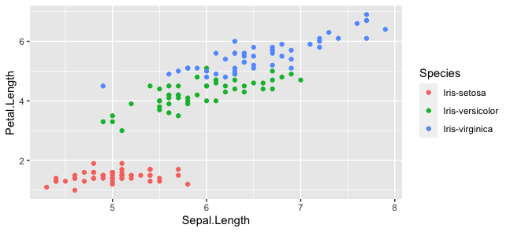
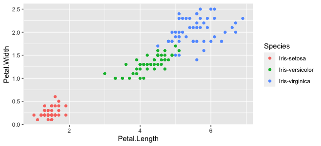
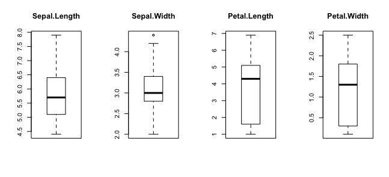
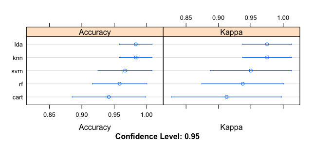

Approximate time: 180 minutes

## CLustering in R (Unsupervised Learning)

K-means clustering is one of the most popular unsupervised learning methods in machine learning. This algorithm helps identify `k` possible groups (clusters) from `n` elements based on the distance between the elements.

The algorithm finds out the distance among each element in your data, then find the number of centroids, allocate the element to the nearest centroids to form clusters, and the ultimate goal is to keep the size of each cluster as small as possible.


One of the common questions regarding the `K-means` algorithm is if it can handle non-numeric data. The short answer is `NO` since the algorithm is using the distance between the observations. However, there are many algorithms out there that can help convert non-numeric features to numeric features, which will allow you to apply the `K-means` algorithm to your data. For example, the `node2vec` model, an algorithmic framework for representational learning on graphs, can convert the data to embeddings, which can later be used in K-means.

#### Loda Data
I used the `iris` dataset in R in this case study.

```r
data("iris")
?iris
```

Before we perform the `K-means` algorithm, let's first check the labels to see how many clusters are present in this dataset.

```r

levels(iris$Species)

Output:
[1] "setosa"     "versicolor" "virginica"
```

Now, let's separat the labels from the original data. In this way, we can treat the data as new, unlabeled data for unsupervised learning purposes.

```r
iris1 <- iris[,-5]
iris_label <- iris[,5]
```

Since all the variables in the iris data are numeric, we do not have to do any data preprocessing. Let's pretend that I never seen this iris data before, so I am wondering what the best `K` for the model (`K` number of clusters).

##### Finding K

In this step, we would need to know two terms, `wss` and `elbow rule` to help us find the best number of centroids.

* **WSS**: The sum distance within the centroids. Since the K-means algorithm's goal is to keep the size of each cluster as small as possible, the small `wss` indicates that every data point is close to its nearest centroids, or say the model has returned good results.

* **Elbow rule/method**: a heuristic used in determining the number of clusters in a dataset. You first plot out the `wss` score against the number of `K`. Because with the number of `K` increasing, the `wss` will always decrease; however, the magnitude of decrease between each `K` will be diminishing, and the plot will be a curve which looks like an arm that curled up. In this way, you secondly need to find out which point falls on the elbow.

```r
# to reproduce the results
# you have to use set.seed()
set.seed(1)
wss<- NULL
for (i in 1:10){
  fit = kmeans(iris1,centers = i)
  wss = c(wss, fit$tot.withinss)
}
plot(1:10, wss, type = "o")
```

Based on the graph above, we can tell that `K = 3` probably will be the answer. And if you recall, the original data indeed has three different species. So far, we are doing a good job! However, you have to keep in mind that the data tends to be neither perfect nor labeled in the real world. And the relationship among the groups is way more complicated than what we have here. So you might discover multiple `K` that could meet your needs. Then, you will have to try them out one by one, study the groups, and justify your answer by doing more in-depth research.

##### Fit & Plot

Let's fit a K-means model with `K = 3` and plot the clusters with the `fpc` package.

```r
install.packages("fpc")
library(fpc)
fit <- kmeans(iris[,-5], 3,)
plotcluster(iris[,-5],fit$cluster,pointsbyclvecd=TRUE)
```

##### Evaluation

When we apply the `K-means` algorithm in R, the function will help ua generate multiple statistics of the model simultaneously, including `TSS`, `BSS`, and what we have discussed above— `WSS`.
* `TSS`: It stands for `Total-Sum-of-Squares`, the total distance of data points from the global mean of the data.
* `BSS`: It is the sum of each cluster's distance to the global mean of the data.

And, `TSS = BSS + WSS`.

Here, we can use another method to evaluate the model you fit. We already know that we want to keep the WSS as small as possible, therefore, theoretically, a high ratio of `BSS` to `TSS` is what we are looking for.

```r
fit$betweenss/fit$totss
```
Output: 

```r
0.8842753
```

## Let's start a demo of Machine Leanring

#### Step 1: Get Your Data
Machine learning usually starts from observed data. You can take your own data set or browse through other sources to find one. There are a few Built-in Datasets of R and we can use them.
In this example, we will be using the Iris data set, which is very well-known in the area of machine learning. This dataset is built into R, so you can take a look at this dataset by typing the following into your console:


Let's download data directly from UCI Machine Learning repository

```r
iris <- read.csv(url("http://archive.ics.uci.edu/ml/machine-learning-databases/iris/iris.data"), 
                 header = FALSE) 

# Print first lines
head(iris)

# Add column names
names(iris) <- c("Sepal.Length", "Sepal.Width", "Petal.Length", "Petal.Width", "Species")

# Check the result
iris
```

#### Step 2: Know Your Data

You need to get your hands dirty, explore and visualize your data set and even gather some more domain knowledge if you feel the data is way over your head.

```r
iris_p1 <- ggplot(iris, aes(Sepal.Length, Sepal.Width, colour=Species)) + geom_point()
print(iris_p1)
```



We can see that there is a high correlation between the `sepal length` and the `sepal width` of the Setosa iris flowers, while the correlation is somewhat less high for the Virginica and Versicolor flowers: the data points are more spread out over the graph and don’t form a cluster like you can see in the case of the Setosa flowers.

The scatter plot that maps the petal length and the petal width tells a similar story:

```r
iris_p2 <- ggplot(iris, aes(Petal.Length, Petal.Width, colour=Species)) + geom_point()
print(iris_p2)
```



We can see that above graph indicates a positive correlation between the petal length and the petal width for all different species that are included into the Iris data set. Of course, you probably need to test this hypothesis a bit further if you want to be really sure of this:

```r

# Overall correlation `Petal.Length` and `Petal.Width`
cor(iris$Petal.Length, iris$Petal.Width)

# Return values of `iris` levels 
x=levels(iris$Species)

# Print Setosa correlation matrix
print(x[1])
cor(iris[iris$Species==x[1],1:4])

# Print Versicolor correlation matrix
print(x[2])             
cor(iris[iris$Species==x[2],1:4])

# Print Virginica correlation matrix
print(x[3])
cor(iris[iris$Species==x[3],1:4])

```

We can see that when we combined all three species, the correlation was a bit stronger than it is when you look at the different species separately: the overall correlation is 0.96, while for Versicolor this is 0.79. Setosa and Virginica, on the other hand, have correlations of petal length and width at 0.31 and 0.32 when you round up the numbers.


#### Step 3: Create a Validation Dataset (Partitioning data)

We need to know that the model we created is any good.Later, we will use statistical methods to estimate the accuracy of the models that we create on unseen data. We also want a more concrete estimate of the accuracy of the best model on unseen data by evaluating it on actual unseen data.
That is, we are going to hold back some data that the algorithms will not get to see and we will use this data to get a second and independent idea of how accurate the best model might actually be.

We will split the loaded dataset into two, `80%` of which we will use to train our models and `20%` that we will hold back as a validation dataset.

To do machine learning, first we need to install a basic library 

```r
install.packages("caret")
library("caret")
```

Now let's partition the data

```r
# create a list of 80% of the rows in the original dataset we can use for training
validation_index <- createDataPartition(iris$Species, p=0.80, list=FALSE)
# select 20% of the data for validation
validation <- iris[-validation_index,]
# use the remaining 80% of data to training and testing the models
dataset <- iris[validation_index,]

```

We have now training data in the dataset variable and a validation set we will use later in the validation variable. Note that we replaced our dataset variable with the `80%` sample of the dataset. This was an attempt to keep the rest of the code simpler and readable.

#### Univariate Plots

```r
x <- dataset[,1:4]
y <- dataset[,5]
```

```r

# boxplot for each attribute on one image
par(mfrow=c(1,4))
  for(i in 1:4) {
  boxplot(x[,i], main=names(iris)[i])}
```



#### Step 4: Train and Evaluate Model

Now it is time to create some models of the data and estimate their accuracy on unseen (test) data.

Here is what we are going to cover in this step:

Set-up the test harness to use 10-fold cross validation.
Build 5 different models to predict species from flower measurements
Select the best model.


##### 10-fold crossvalidation
We will 10-fold cross validation to estimate accuracy. This will split our dataset into `10` parts, `train in 9` and `test on 1` and release for all combinations of train-test splits. We will also repeat the process 3 times for each algorithm with different splits of the data into 10 groups, in an effort to get a more accurate estimate.

```r
# Run algorithms using 10-fold cross validation
control <- trainControl(method="cv", number=10)
metric <- "Accuracy"
```
We are using the metric of “Accuracy” to evaluate models. This is a ratio of the number of correctly predicted instances in divided by the total number of instances in the dataset multiplied by 100 to give a percentage (e.g. 95% accurate). We will be using the metric variable when we run build and evaluate each model next.

##### Build Models (Training)

We don’t know which algorithms would be good on this problem or what configurations to use. We get an idea from the plots that some of the classes are partially linearly separable in some dimensions, so we are expecting generally good results.

Let’s evaluate 5 different algorithms:

* Linear Discriminant Analysis (LDA)
* Classification and Regression Trees (CART).
* k-Nearest Neighbors (kNN).
* Support Vector Machines (SVM) with a linear kernel.
* Random Forest (RF)

This is a good mixture of simple linear (LDA), nonlinear (CART, kNN) and complex nonlinear methods (SVM, RF). We reset the random number seed before reach run to ensure that the evaluation of each algorithm is performed using exactly the same data splits. It ensures the results are directly comparable.

```r

install.packages("e1071", dep = TRUE) 

# a) linear algorithms
set.seed(7)
fit.lda <- train(Species~., data=dataset, method="lda", metric=metric, trControl=control)
# b) nonlinear algorithms
# CART
set.seed(7)
fit.cart <- train(Species~., data=dataset, method="rpart", metric=metric, trControl=control)
# kNN
set.seed(7)
fit.knn <- train(Species~., data=dataset, method="knn", metric=metric, trControl=control)
# c) advanced algorithms
# SVM
set.seed(7)
fit.svm <- train(Species~., data=dataset, method="svmRadial", metric=metric, trControl=control)
# Random Forest
set.seed(7)
fit.rf <- train(Species~., data=dataset, method="rf", metric=metric, trControl=control)

```

##### Now it is the time to select the best model

We now have 5 models and accuracy estimations for each. We need to compare the models to each other and select the most accurate. We can report on the accuracy of each model by first creating a list of the created models and using the summary function.

```r
results <- resamples(list(lda=fit.lda, cart=fit.cart, knn=fit.knn, svm=fit.svm, rf=fit.rf))
summary(results)
```
Output:
```r
Call:
summary.resamples(object = results)

Models: lda, cart, knn, svm, rf 
Number of resamples: 10 

Accuracy 
          Min.   1st Qu. Median      Mean 3rd Qu. Max. NA's
lda  0.9166667 1.0000000      1 0.9833333       1    1    0
cart 0.8333333 0.8541667      1 0.9416667       1    1    0
knn  0.9166667 1.0000000      1 0.9833333       1    1    0
svm  0.8333333 0.9375000      1 0.9666667       1    1    0
rf   0.8333333 0.9166667      1 0.9583333       1    1    0

Kappa 
      Min. 1st Qu. Median   Mean 3rd Qu. Max. NA's
lda  0.875 1.00000      1 0.9750       1    1    0
cart 0.750 0.78125      1 0.9125       1    1    0
knn  0.875 1.00000      1 0.9750       1    1    0
svm  0.750 0.90625      1 0.9500       1    1    0
rf   0.750 0.87500      1 0.9375       1    1    0
```


We can also create a plot of the model evaluation results and compare the spread and the mean accuracy of each model. There is a population of accuracy measures for each algorithm because each algorithm was evaluated 10 times (10 fold cross validation).

```r
# compare accuracy of models
dotplot(results)
```
We can see that the most accurate model in this case was LDA:



The results for just the LDA model can be summarized.

```r
print(fit.lda)
```

Output:

```r
Linear Discriminant Analysis 

120 samples
  4 predictor
  3 classes: 'Iris-setosa', 'Iris-versicolor', 'Iris-virginica' 

No pre-processing
Resampling: Cross-Validated (10 fold) 
Summary of sample sizes: 108, 108, 108, 108, 108, 108, ... 
Resampling results:

  Accuracy   Kappa
  0.9833333  0.975
```

#### Evaluate Model

The LDA was the most accurate model. Now we want to get an idea of the accuracy of the model on our validation set.

This will give us an independent final check on the accuracy of the best model. It is valuable to keep a validation set just in case you made a slip during such as overfitting to the training set or a data leak. Both will result in an overly optimistic result.

We can run the LDA model directly on the validation set and summarize the results in a confusion matrix.

```r
# estimate skill of LDA on the validation dataset
predictions <- predict(fit.lda, validation)
confusionMatrix(predictions, validation$Species)
```

Output:

```r
Confusion Matrix and Statistics

                 Reference
Prediction        Iris-setosa Iris-versicolor Iris-virginica
  Iris-setosa              10               0              0
  Iris-versicolor           0               9              0
  Iris-virginica            0               1             10

Overall Statistics
                                          
               Accuracy : 0.9667          
                 95% CI : (0.8278, 0.9992)
    No Information Rate : 0.3333          
    P-Value [Acc > NIR] : 2.963e-13       
                                          
                  Kappa : 0.95            
                                          
 Mcnemar's Test P-Value : NA              

Statistics by Class:

                     Class: Iris-setosa Class: Iris-versicolor Class: Iris-virginica
Sensitivity                      1.0000                 0.9000                1.0000
Specificity                      1.0000                 1.0000                0.9500
Pos Pred Value                   1.0000                 1.0000                0.9091
Neg Pred Value                   1.0000                 0.9524                1.0000
Prevalence                       0.3333                 0.3333                0.3333
Detection Rate                   0.3333                 0.3000                0.3333
Detection Prevalence             0.3333                 0.3000                0.3667
Balanced Accuracy                1.0000                 0.9500                0.9750
```
